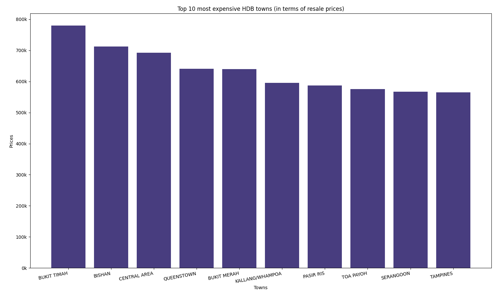
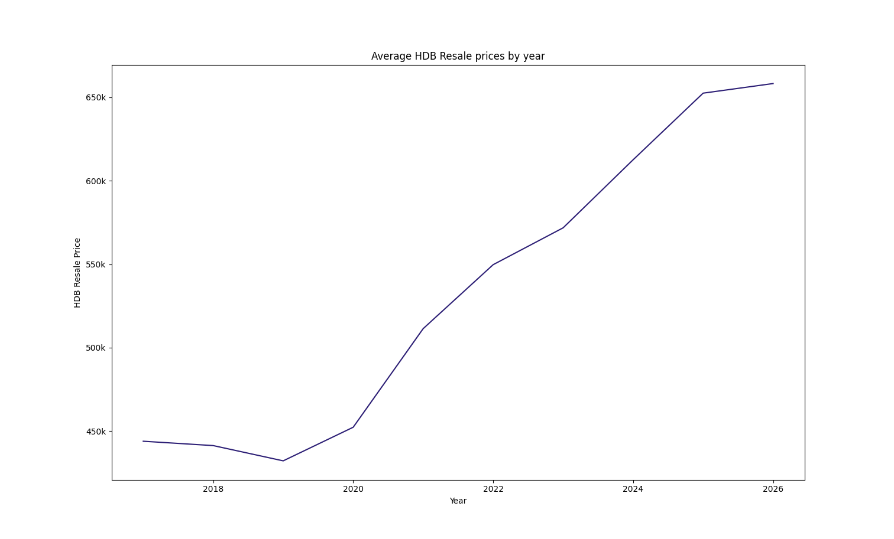
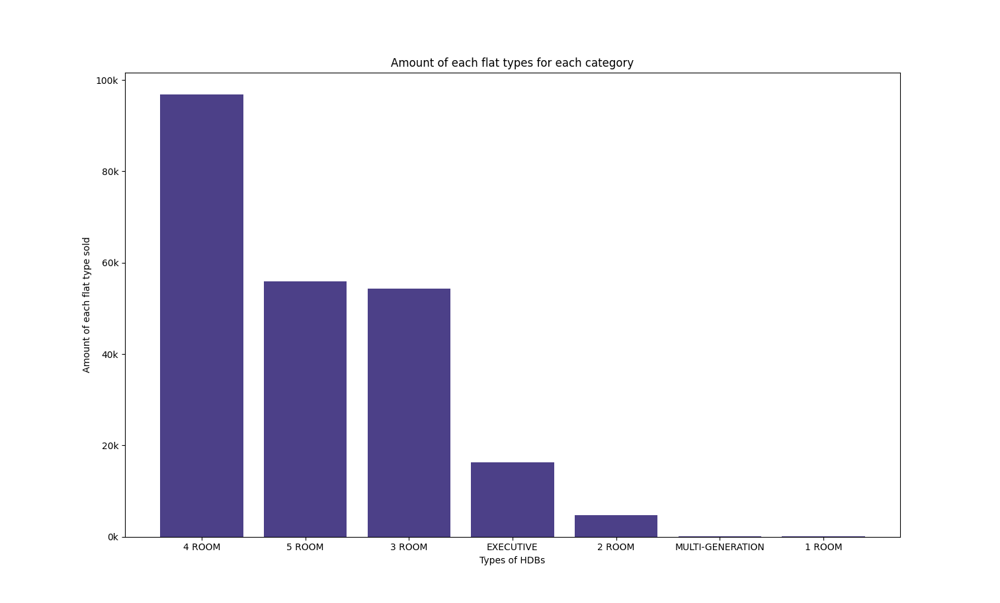

# HDB Resale Price Analysis

## Dataset Used:
[data.gov.sg - HDB Resale Flat Prices](https://data.gov.sg/collections/189/view)

It contains information on HDB resale transactions, including town, flat type, resale price, and transaction date.

## What is it?
This is a Python program using matplotlib and pandas libaries to analyze HDB resale prices in Singapore. It shows the top 10 most expensive towns in Singapore and returns the data visually with a plotted bar chart. This analysis helps spot trends in the Singapore housing market and can be useful for potential buyers, sellers, and investors to make informed decisions. 

## Charts & Key Findings

### Top 10 Most Expensive Towns

Bukit Timah leads with an average resale price of ~$775k, significantly higher 
than most other towns.

### Average Resale Price by Year

Resale prices show a clear upward trend over the years, with a notable dip 
around 2013-2015 before recovering.

### Flat Type Distribution

4-room flats are the most commonly transacted flat type in Singapore.

## Tech Stack
- Python
- Pandas 
- Matplotlib

## How to Use
1. Clone the repository
2. Run analysis.py in your terminal
3. The program will output the top 10 most expensive towns and display a bar chart of the resale prices.

## What I Learned
- How to load and process real-world CSV data with pandas
- How to group and aggregate data using groupby
- How to visualise data with matplotlib
- How to format charts for readability
- Working with datetime data in pandas

## Future Improvements

- Add a line chart to visualize how average resale prices have changed over the years.  
- Implement a CLI menu to allow users to select different analyses (e.g., top towns, flat types, or trends over time).  
- Analyze flat types to see which are most common or most expensive.  
- Include boxplots to visualize price distributions and outliers in each town.  
- Further enhance visualizations with color-coding, annotations, and formatted labels for better readability.
