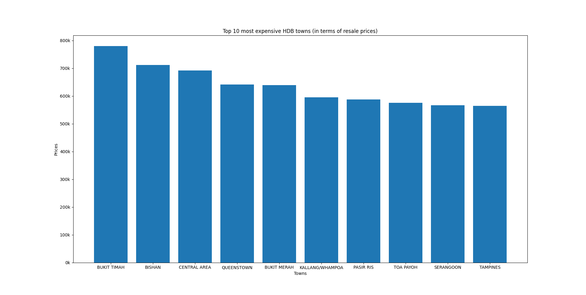

# HDB Resale Price Analysis

## Dataset Used:
[data.gov.sg - HDB Resale Flat Prices](https://data.gov.sg/collections/189/view)

It contains information on HDB resale transactions, including town, flat type, resale price, and transaction date.

## What is it?
This is a Python program using matplotlib and pandas libaries to analyze HDB resale prices in Singapore. It shows the top 10 most expensive towns in Singapore and returns the data visually with a plotted bar chart. This analysis helps spot trends in the Singapore housing market and can be useful for potential buyers, sellers, and investors to make informed decisions. 

## Image of the output:

## How to Use
1. Clone the repository
2. Run analysis.py in your terminal
3. The program will output the top 10 most expensive towns and display a bar chart of the resale prices.

## Why I built this project:
I built this project to practice data analysis and visualization skills using real-world data. As a bonus, I get to learn about the property market in Singapore.

## Future Improvements

- Add a line chart to visualize how average resale prices have changed over the years.  
- Implement a CLI menu to allow users to select different analyses (e.g., top towns, flat types, or trends over time).  
- Analyze flat types to see which are most common or most expensive.  
- Include boxplots to visualize price distributions and outliers in each town.  
- Further enhance visualizations with color-coding, annotations, and formatted labels for better readability.
